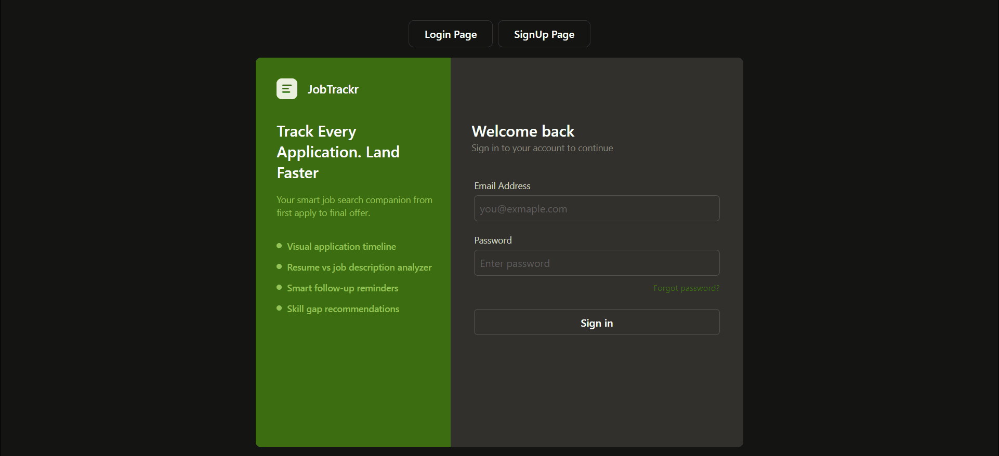

# 💼 JobTrackr – Smart Job Application Tracking System

A modern full-stack MERN application designed to help job seekers efficiently manage, organize, and track their job applications throughout the hiring process. The platform provides analytics, application tracking, resume analysis, and insights to make job searching more organized and data-driven.

---
## Live Link
[(https://job-trackr-gilt.vercel.app/)](https://job-trackr-gilt.vercel.app/)

---
## 📸 Screenshots

[](client/src/assets/jobtrackr.gif)

---

## 🚀 Features

- 🔐 Secure user authentication using JWT
- 📋 Add, update, and delete job applications
- ⭐ Mark applications as favorites
- 📊 Dashboard with real-time application statistics
- 📅 Track application status and timeline
- 🔍 Search and filter applications
- 📤 Export job applications to CSV
- 📄 Resume Analyzer with AI-powered feedback
- 📈 Skill Gap Analysis based on rejected applications

---

## 🛠️ Tech Stack

### Frontend
- React.js
- Vite
- Tailwind CSS
- Axios
- React Router DOM

### Backend
- Node.js
- Express.js
- JWT Authentication
- Multer

### Database
- MongoDB
- Mongoose

### AI / Machine Learning
- Python
- TensorFlow / Keras
- OpenCV
- NumPy

---

## 📂 Project Structure

```
JobTrackr
│
├── client
│   ├── src
│   ├── public
│   └── package.json
│
├── server
│   ├── controllers
│   ├── middleware
│   ├── models
│   ├── routes
│   ├── uploads
│   └── server.js
│
└── README.md
```

---

## ⚙️ Installation

### Clone the repository

```bash
git clone https://github.com/samIRaahmeD6/JobTrackr.git
```

### Install Frontend

```bash
cd client
npm install
```

### Install Backend

```bash
cd ../server
npm install
```

---

## 🔑 Environment Variables

Create a `.env` file inside the **server** folder.

```env
PORT=5000
MONGO_URI=your_mongodb_connection_string
JWT_SECRET=your_secret_key
```

---

## ▶️ Run the Application

### Start Backend

```bash
cd server
npm run dev
```

### Start Frontend

```bash
cd client
npm run dev
```

Open your browser and visit:

```
http://localhost:5173
```

---

## 🎯 Future Enhancements

- 📧 Email reminders for follow-ups
- 🤖 AI job recommendations
- 📅 Interview scheduling
- 🌙 Dark mode
- 🐳 Docker support
- ☁️ Cloud deployment

---

## 👩‍💻 Author

**Samira Ahmed**

- GitHub: https://github.com/samIRaahmeD6
- LinkedIn: https://www.linkedin.com/in/samiraahmed1

---

⭐ If you found this project useful, consider giving it a **star** on GitHub!
